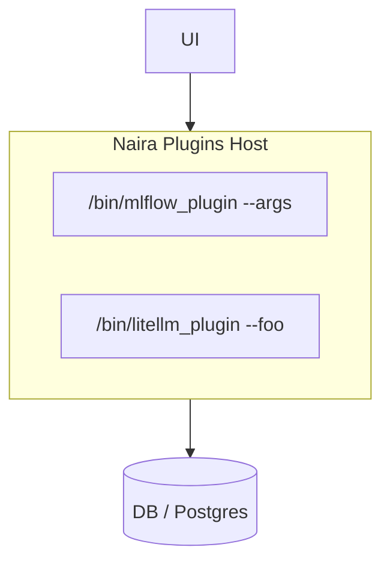

# RFC-004: Core API v1 Design

## Notes

Deployment architecture high-level overview:



High-level design principles and decisions:

- we're "schema-less"
- each plugin writes to separate namespace (but Kinds + Paths are shared/unified)
- plugin writes a full snapshot always
- plugin has 1 instance, no more
- UI can only read (for now, in v1)
  - v2: will allow writing annotations from UI & CRUD of additional nodes/relations - needs additional API design

## plugins_registry.json

```json
{
  "mlflow/clusterA": {
    "cmd": "/path/to/mflfow_plugin -path_prefix clusterA -cfg mlflow_clusterA.ini",
    "schedule": "@hourly",
    "description": "MLFlow on cluster A"
  },
  "litellm": {
    "cmd": "/path/to/litellm_plugin",
    "schedule": "*/10 * * * *"
  },
  "appscanner/clusterX": {
    "cmd": "/bin/appscanner"
  }
}
```

**LATER: plugins can also be dynamically registered in DB table**

*private type Plugin struct {*  

| Field              | Type     | Note                                  |
|--------------------|----------|---------------------------------------|
|| *// Private (internal) DB fields:* ||
| *id*               | *uint64* |                                       |
| *name*             | *string* | *// from plugins_registry.json config* |
| *cmd*              | *string* | *// from plugins_registry.json config* |
| *schedule*          | *string* | *// cronspec*                         |
| *lastRun*          | *datetime* | *// for cronspec tracking*          |
| *currentSnapshotID* | *uint64* |                                       |

*}*

## Plugins protocol types


type **NodeID** struct {

| Field | Type   | Note                                           |
|-------|--------|------------------------------------------------|
| Kind  | string | // e.g. "model", "dataset", "app"              |
| Path  | string | // unique fully qualified name in path format, WITHOUT kind |

}

*// NOTE: different plugins can claim the same ID - the Properties will then be unified*  
*// (concatenated) from all such plugins*  
*// NOTE: pluginID+ID together are a globally unique key*  
type **NodeClaim** struct {

| Field        | Type   | Note                                                 |
|--------------|--------|------------------------------------------------------|
| ID           | NodeID | // see above - **Kind+Path**                         |
| Properties   | JSON   | // any data the plugin wants to attach to Node; "aspect" |
|| *// Private (internal) extra DB fields:* ||
| *pluginID*   | *uint64* | |
| *snapshotID* | *uint64* | |

}

*// NOTE: pluginID+Kind+From+To together are a globally unique key*  
type **RelationClaim** struct {

| Field        | Type   | Note                                                      |
|--------------|--------|-----------------------------------------------------------|
| Kind         | string | // e.g. "trained_on"                                      |
| From         | NodeID | // see above - **Kind+Path**                              |
| To           | NodeID | // see above - **Kind+Path**                              |
| Properties   | JSON   | // any data the plugin wants to attach to Relation <br>> // NOTE: probably we don't want to use Props on relations |
|| *// Private (internal) extra DB fields:* ||
| *pluginID*   | *uint64* |  |
| *snapshotID* | *uint64* |  |

}

## Plugins protocol flow

Job started "every hour" (configurable) for Plugin "foobar":

1. Naira: generates new internal SnapshotID for "plugin:foobar", and keeps it in RAM.
2. Naira: spawns /path/to/plugin/foobar process.
3. foobar process: writes on stdout a line that is either:
   - NodeClaim
   - RelationClaim
4. Naira: processes the line
   - If such NodeClaim/RelationClaim already exists in internal DB, marked with "plugin:foobar", replaces the Properties of that NodeClaim/RelationClaim.
   - If it doesn't exist, creates it with Properties.
5. foobar process: loops back to step (3), or exits
6. if foobar process exited successfully (error status 0):
   1. Naira: deletes any Nodes/Relations marked with "plugin:foobar" and different SnapshotID
   2. Naira: updates SnapshotID in DB for "plugin:foobar".

If foobar process exited with failure, Naira keeps internal DB data marked "plugin:foobar" in partial state, and runs the process again to try and achieve eventual consistency.

## UI API

> [!WARNING]
> The API below is a draft idea. The actual API implementation **must follow the [AIP.dev guidelines](https://google.aip.dev/general)** as described at:
>
> https://google.aip.dev/general
>
> (AIP.dev describes how to implement pagination & other API features in future-proof way)

GET <b>/v1/node/</b>?kind="model"&path="clusterA/deepseek"

```json
[
  {
    "kind": "model",
    "path": "clusterA/deepseek",
    "props": {
      "mlflow/clusterA": { "release": "2.34", "token_price": "$10" },
      "litellm": { "token_price": "$5" },
      "UI": { "note": "Problems last week" }
    }
  }
]
```

GET <b>/v1/relation/</b>?kind="trained_from" \  
 &toKind="model" \  
 &toPath="clusterA/deepseek" \  
 &fromKind="dataset"

```json
[
  {
    "kind": "trained_from",
    "toKind": "model",
    "toPath": "clusterA/deepseek",
    "fromKind": "dataset",
    "fromPath": "teamT/release20250712.1/public_domain_github",
    "props": {
      "datahub": { "trainer": "Zhang Z." }
    }
  },
  {
    "kind": "trained_from",
    ...
    "fromPath": "teamY/release20240921.5/wikipedia_dump",
    "props": {
      "..."
    }
  }
]
```

> [!WARNING]
> **TODO: wrap UI API as GraphQL**
