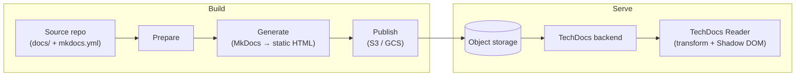

# RFC-007: Documentation Integration in Naira

| Field            | Value                                       |
|------------------|---------------------------------------------|
| RFC              | 007                                         |
| Title            | Documentation Integration in Naira          |
| Author(s)        | @Daviidg                                    |
| Target Milestone | M1 - Foundation                             |
| Status           | accepted                                       |
| Type             | Feature                                     |
| Created          | 2026-07-09                                  |


## Summary

This RFC documents the research on how Naira should integrate and display documentation. The goal is to make docs feel like they "live within Naira", meaning they are discoverable, in-context, permission-aware, and nice to read.

The recommendation is a **hybrid approach**: start with an MVP that stores documentation metadata and links on catalog entities and renders Markdown previews directly in Naira (Option B), keep deep links as the fallback for external systems (Option A), and later introduce a TechDocs-inspired static site reader for teams with full generated docs sites (Option C).


## Motivation

Naira aims to be an Internal Development Platform for AI Engineering. A useful IDP experience requires documentation *in context*: when a user opens a software component, model, dataset, MCP integration, inference endpoint, or gateway route, they should also see relevant docs, examples, ownership notes, and runbooks.

Documentation lives in many places: repository `README.md` files, `/docs` folders, a central docs website, generated API docs, OpenAPI spec, runbooks in wikis or operations repos, and external systems such as Confluence or SharePoint.

The goal is therefore not to build another documentation platform, but to bring documentation from all of these sources into Naira, while authoring, publishing, and storage remain in their native locations, with the tools each developer team already uses.


## Documentation Assets in Naira

Naira deals with two fundamentally different documentation categories:

1. **Naira's own documentation** *(simple)*: the platform's own product/project documentation: onboarding, concepts, how-to guides, plugin-authoring guides, and the reference for Naira's own APIs. It is generated and owned by Naira and is **not the focus of this RFC**.

2. **Resource-tied documentation** *(complex)*: the docs of the assets Naira catalogs, owned by the teams whose resources they describe. They live in each asset's own repository and should be explorable when the user opens the asset in the UI. What this looks like depends on the resource type:
   - **Generic software**: README, `/docs`, runbooks, examples, architecture/ADRs, OpenAPI specs, install/configuration/usage docs.
   - **AI models**: model cards, Hugging Face cards, notebooks.
   - **Datasets**: dataset cards (schema, provenance, licensing, usage notes).
   - **MCP servers**: capability and tool descriptions, usage guidance, integration examples.
   - **Inference endpoints / gateway routes**: API specs, usage notes.

The rest of this RFC is about category 2.


## Reference Model: Backstage TechDocs

To determine how Naira should handle resource-tied documentation, we analyzed how Backstage approaches the problem with **TechDocs**, which is fully built around the *"docs-like-code"* philosophy. Instead of housing documentation in an isolated wiki or separate portal, files are written in Markdown and live directly inside the software component's source repository. For a repo to expose its documentation to Backstage it needs:

1. **An `mkdocs.yml` configuration file**: TechDocs uses MkDocs and Material for MkDocs to define the site name and structure/navigation:

   ```yaml
   site_name: "Order Processing Service"
   site_description: "Developer documentation"
   # This is mandatory so Backstage can safely inject its theme and styles
   plugins:
     - techdocs-core
   # Defines the navigation tree on the left sidebar
   nav:
     - Getting Started:
         - Introduction: index.md
         - Quick Start Guide: docs/getting-started/quick-start.md
     - Architecture:
         - Overview: docs/architecture/overview.md
         - Database Schema: docs/architecture/database.md
     - Operations:
         - Runbooks & Alerts: docs/operations/runbooks.md
   ```

2. **A `/docs` directory**: contains the actual Markdown files (e.g., `index.md`).

3. **A Backstage catalog definition (`catalog-info.yaml`)**: the software entity registers itself to the Backstage ecosystem and uses a metadata annotation to point to the documentation's location:

   ```yaml
   apiVersion: backstage.io/v1alpha1
   kind: Component
   metadata:
     name: order-processing-service
     annotations:
       # This annotation activates the Docs tab and points to your mkdocs.yml
       backstage.io/techdocs-ref: dir:.
   ```

TechDocs generation is a three-step pipeline: **prepare** (fetch doc sources), **generate** (run MkDocs to produce static HTML), and **publish** (upload the output to storage such as AWS S3 or GCS).

During serving, when a user opens a docs page, the TechDocs Reader requests it from the TechDocs plugin with the entity ID and path; the backend fetches the static files from storage and returns them. The reader can use custom *Transformers* to rewrite the static HTML (remove headers, …) and renders the result inside a Shadow DOM so the docs site's CSS cannot leak into the portal UI. It also strips all JavaScript for security reasons.

Simplified flow (see the [TechDocs architecture docs](https://backstage.io/docs/features/techdocs/architecture) for details):



## Options Evaluated

### Option A: Deep-Link Only

The most minimal possible integration. Naira stores documentation as links (metadata) on catalog entities and nothing more. Users cannot read docs inside Naira, they only see links pointing to the original docs.

The main downside is that deep-link-only forces a context switch out of the portal to read anything. Search is also limited to metadata, there is no full-text search over content. Since Naira stores no permissions, authorization is completely delegated to the source system.

**Verdict: rejected as the primary approach.** Naira docs can't rely on deep links only. It remains the right *fallback* for external systems Naira can't or shouldn't render (Confluence, SharePoint, …).

### Option B: Markdown Preview from Repositories

Naira fetches and renders selected Markdown files: `README.md`, `/docs/index.md`, or explicitly configured paths.

How it would work:

- **Discovery (git plugin)**: while scanning a repository, the git plugin will auto-discover documentation at well-known and explicitly configured paths (`README.md`, `/docs`, …).
- **Ingestion**: for each discovered doc, a `DocumentationNode` entity is created in the catalog and linked to the owning resource via a `hasDocumentation` relationship:

  ```json
  {
    "kind": "DocumentationNode",
    "id": "doc:recommendation-service:readme",
    "type": "readme",
    "source": {
      "kind": "git",
      "ref": "github.com/example/recommendation-service",
      "path": "/README.md",
      "rev": "main"
    },
    "render": "inline",
    "authority": "naira-enforced"
  }
  ```

- **Authorize (backend)**: before returning anything, the backend runs the same OpenFGA/workspace checks that gate the owning entity. If the user can access the entity, access to its docs is assumed.
- **Render (frontend)**: the user opens the resource's *Documentation* tab. If a `DocumentationNode` is associated, the Markdown is fetched at runtime and rendered to native components with `react-markdown` (+ `remark-gfm` for tables/task lists, `rehype-sanitize` for safety, syntax highlighting, optionally Mermaid).

**Verdict: recommended for MVP.** Very low friction and maintenance. Users see in-context, always-up-to-date docs, with authorization and search indexing still possible. The limitation is that it restricts docs to Markdown (which is anyway what most AI assets use: model cards, dataset cards, MCP descriptions) and doesn't support multipage docs sites with navigation.

### Option C: TechDocs-Like Static Site Reader

Docs are generated outside Naira, transform into static HTML/assets, stored in object storage, and read through a Naira docs backend/reader. Essentially the Backstage TechDocs approach, in four stages:

1. **Generate (in the team's CI)**: the repo's pipeline runs a site generator to produce static HTML.
2. **Store (object storage)**: the built site is published to cloud object storage (S3/GCS).
3. **Serve (Naira backend)**: when a user opens the docs, the backend fetches the static files, applies the OpenFGA/workspace check for the owning entity, strips active content (JavaScript), and returns sanitized HTML.
4. **Render (Naira reader)**: the frontend renders that HTML in a style-isolated container so the doc site's CSS can't leak into the portal, optionally injecting portal-native UI (edit link, freshness badge, report-issue, "copy as context for AI").

The `DocumentationNode` would be richer, pointing at the generated site:

```json
{
  "kind": "DocumentationSiteNode",
  "id": "doc:payments-platform:site",
  "type": "docs-site",
  "source": {
    "kind": "git",
    "ref": "github.com/example/payments-platform",
    "path": "/docs",
    "rev": "main"
  },
  "storage": {
    "kind": "object-storage",
    "location": "s3://example-naira-docs/payments-platform/",
    "read_access": "backend-only"
  },
  "search_index": "search/search_index.json",
  "entrypoint": "index.html",
  "render": "reader",
  "authority": "naira-enforced"
}
```

The main benefits are scalability (the HTML is pre-generated in CI and only needs to be fetched) and being the only option that renders complete multi-page documentation sites (navigation trees, cross-page links, generator features, themed layout).

**Verdict: not for MVP, good later addition.** A mature but heavyweight solution with high adoption friction: it requires teams to run CI/CD that generates static sites, plus a build pipeline, object storage, and a transform/sanitize layer on Naira's side. Worth adding later so teams with TechDocs-style docs can use Naira

### Option D: VitePress-Based Naira Docs Integration

Naira standardizes on VitePress as the documentation generator for resource docs. This would couple the docs solution to VitePress and effectively exclude teams using other generators or forms of documentation.

**Verdict: rejected for resource docs.** VitePress makes sense for Naira's own authored docs (the current internal docs stack, also aligned with other ApeiroRA tools), but not as a mandated generator for resource-tied documentation.

### Option E: External Docs Federation

Naira acts as a documentation federation layer: it indexes metadata *and permissions* for docs in multiple external systems, but delegates reading to those systems or embeds only safe previews.

This is similar to Option A, with the key difference that permissions are stored too. In Option A, Naira stores "dumb links" and leaves the auth check to the source system, so users may be shown links they can't actually open. By storing permissions, federated search can filter restricted docs.

**Verdict: rejected.** Much more complex than Option A. It requires a connector that understands permissions per each external source, while still not solving the main problem of the in-context reading experience. A lot of work for little upside.

### Option F: Hybrid (recommended)

The initial hypothesis from the spike ticket:

- Store documentation metadata and links on catalog entities.
- Show selected docs context directly inside Naira, starting with README or configured Markdown preview.
- Use deep links for full documentation sites and external docs systems.
- Later introduce a TechDocs-inspired static docs reader/proxy for teams that want generated docs rendered inside Naira with authorization and consistent UX.

**Verdict: validated.** Start with Markdown rendering (Option B), which covers most basic cases out of the box, keep deep links (Option A) as the external fallback, and move to a TechDocs-style reader (Option C) when needed.


## Design Decisions

### Documentation experience

The MVP experience is **docs-in-context on the entity page**, not a separate docs destination. When a user opens a component, model, dataset, MCP, endpoint, or gateway route, they see a documentation section showing the entity's main documentation rendered inline (Markdown preview in a panel) and links to everything else.

### Source of truth

- Resource docs live in their source repositories.
- Docs already in external systems (Confluence, SharePoint) stay there and are deep-linked.
- If static site support (Option C) is added later, object storage (S3/GCS) is needed for the generated HTML.

**Naira does not become the authoring source of truth.** It only *references and presents* documentation. Docs cannot be edited in the Naira UI; instead, edit links point back to the original source. Authoring stays with the resource-owning teams in their repos.

### Security and authorization

- Docs authorization is enforced via **OpenFGA, gated the same way as the owning entity**: if the user can access the entity, they can read its docs.
- All docs access is **proxied through the Naira backend**. The browser never receives a repository token or a signed direct-fetch link. The flow is strictly:

  `browser → Naira backend → git host / storage → sanitized content → browser`

- All fetched content is sanitized before rendering (`rehype-sanitize` for Markdown; stripping JavaScript and style-isolating for the later static reader).

### Search and discoverability

Docs lose value if they can't be found, so documentation should eventually be searchable through Naira's global search. For MVP it is sufficient that docs are associated with the resources they belong to (users click a resource and see its documentation in context). When search is added, the indexing strategy depends on the source:

- **Markdown files**: index the full content.
- **External sources (Confluence, SharePoint)**: index only metadata (title, type, owner, link).
- **Static sites (later, via the reader)**: index the per-site search index the build already produces (e.g., `search_index.json`) rather than re-parsing HTML.

Each indexed doc carries a reference back to its owning entity, so search results link back to catalog pages.

### Documentation Generators

If/when Naira implements the static site reader (Option C), teams will bring docs built with many different generators (MkDocs, Zensical, Docusaurus, VitePress, Hugo, …). **Naira should not couple its docs support to any specific one of them.** The reader contract should accept a generic "sanitized HTML + nav metadata + search index" shape, regardless of which generator produced it.

Backstage TechDocs is an example. One of its major pain points is being extremely tightly coupled to MkDocs-Material's output: instead of accepting a generic shape, the reader only transforms MkDocs-specific HTML/CSS against known selectors. The main issue now is MkDocs is not mantained anymore and moving to another option might require teams to migrate their current doc pipelines.

A generator-agnostic contract keeps Naira insulated from any single generator's lifecycle, and support for generators that don't natively produce the expected shape can be added as plugins.


### Operational model

For the MVP, **no CI/CD or generation step is needed**. During resource ingestion, Naira attaches documentation links to the resource in the catalog, then fetches and renders the Markdown on demand at read time. Key to low adoption friction is **autodiscovery**: a resource gets docs the moment its repo is ingested — README, `/docs` files, OpenAPI spec — all with edit links back to git.

If/when static site support is implemented, generation happens in the teams' repository CI/CD (as in TechDocs) and the output is stored in object storage.

### Extensibility

- The catalog gains a `DocumentationNode` entity attached to resources via a `hasDocumentation` relationship (see Option B/C examples).
- For static-site docs there are many generators a team could use (Docusaurus, Zensical, MkDocs, VitePress, Hugo). The reader contract should stay generic ("sanitized HTML + nav metadata + search index"), and support for additional generators or external docs systems can be implemented as **plugins**.


## Recommendation

1. **MVP (M1)**: implement Option B — `DocumentationNode` in the catalog, autodiscovery of README/configured Markdown paths at ingestion, backend-proxied fetch with OpenFGA checks, sanitized Markdown rendering on the entity page. Deep links (Option A) for everything else.

- Define the `DocumentationNode` schema and `hasDocumentation` relationship in the catalog.
- Implement docs autodiscovery during ingestion (README, `/docs`, OpenAPI, model/dataset cards). This will likely involve an extension of the proposed git plugin for software entities.
- Implement the backend docs proxy with OpenFGA checks and Markdown sanitization.
- Implement the frontend Documentation tab (Markdown renderer with GFM, syntax highlighting, Mermaid).
- Decide how to visually mark external links whose authorization Naira cannot enforce.
- Design the docs search indexing strategy alongside Naira's global search work.

2. **Later milestone**: implement Option C — a generator-agnostic static site reader (generate in team CI → object storage → backend authz/sanitize → style-isolated reader), explicitly avoiding TechDocs' MkDocs coupling.


## References

- Backstage TechDocs: https://backstage.io/docs/features/techdocs/
- TechDocs architecture: https://backstage.io/docs/features/techdocs/architecture
- MkDocs: https://github.com/mkdocs/mkdocs
- Naira docs site (VitePress): https://github.com/naira-project/naira-project.github.io
- RFC-004 (Core API v1 Design): [rfc-004-core-api-v1-design.md](rfc-004-core-api-v1-design.md)
- ADR-002 (Build a Custom Catalog Core): [../adr/002-build-a-custom-catalog-core.md](../adr/002-build-a-custom-catalog-core.md)
