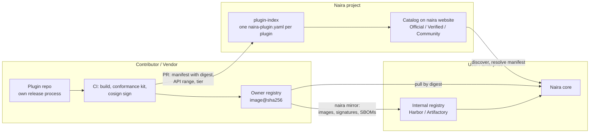

# RFC 010 Plugin Ecosystem

Plugins are an essential part of Naira. It allows to adapt to the recent trends and include any new upcoming tools and technologies into it.

However, right now the way plugins are managed is an intermediate solution. Therefore we have to discuss how a target picture looks like.

## Overarching Idea

The core of Naira is responsable for connecting different plugins, running its entity model and provide a unified API to interact with Naira and every assoziated tool. 

Plugins on the other hand are providing access and retrieving information from a specific tool/software/system/platform. This can be practically anything, ideally its limited to the context of AI Engineering. As there is an almost unlimited number of solutions out there, it's not the purpose of the Naira development team to create for any tool a plugin. Our focus is on building a baseline and then extend the core, rather to built a holistic ecosystem.

This means, that contributors and plugin providers need a place where a) to push a plugin, and where b) consumer can find plugins and bring them to Naira.

## Organizational Part

The organizational part is kinda simple:
- all plugins are living within one repository
- every plugin has an own folder
- the README.md is also an index file where Plugins are listed with relevant information and maybe categorized

We for sure will need to implement a couple of rules and approaches, e.g. every PR can only touch one plugin folder, or every plugin versions for it self. 

However, this approach has several issues, like: an official versioning is hard, we might not be able to really handle docens of plugins as when the code moves to our repository we take also ownership, and this last part comes most compliated into the game. 

So we could run a decentralized approach and maintain in the plugins repository the linking to those plugins, their version etc. This way, every provider handels their own versioning, and keeps the responsability. 

Therefore, we might want to go a middle path, moving existing plugins and their information and relation into an own repository. Provide linking to external contributed plugins that we will make visible in a Naira Website Marketplace.


# Summary

Naira is an open-source AI Engineering Hub built on a central catalog and a plugin model: each plugin is a standalone, optimized container image that connects an external tool (LiteLLM, ArgoCD/Flux, the LGTM observability stack, vLLM, and others) to the Naira core. The goal of this RFC is to decide how community and vendor plugins are distributed and maintained so that the core team does not have to build and own dozens of integrations. This document contrasts four models seen in comparable ecosystems and recommends a hybrid: a thin, Naira-owned plugin index of manifest files that reference externally hosted, digest-pinned container images, a browsable catalog generated from that index, three trust tiers, and a self-service conformance kit so quality does not become a review bottleneck. Governance and security are only sketched here and will be detailed in follow-up RFCs.

## Problem statement, goals and non-goals

Today the reference integrations live inside the naira-project repositories and are effectively owned by the core team. That is fine for a handful of reference plugins, but it does not scale: every new tool an AI engineer wants to connect (a different gateway, a different vector store, a different observability backend) becomes a support and review burden on us, and it couples every plugin's release to our cadence. We want an ecosystem where the people who care about a given tool, its vendor or its users, contribute and maintain the plugin, while Naira guarantees a consistent contract and a trustworthy discovery experience.

### Goals

- Let third parties publish and maintain Naira plugins without core-team involvement in each release.
- Give users a single, trustworthy place to discover plugins and understand who maintains each one.
- Keep the core team's ongoing cost roughly flat as the number of plugins grows.
- Work well for enterprises with air-gapped or proxied registries.
- Preserve a clear compatibility signal between a plugin and the Naira API version it targets.

### Non-goals

- Defining the plugin runtime contract/API itself (assumed to exist and to still be evolving).
- Detailed security and governance policy (later RFCs).
- Hosting or proxying plugin code centrally.
- Supporting non-container plugin formats now (kept as a future extension point).

## Options considered
### Option A: Central monorepo, contributors submit plugin code into their own folder

Contributors add their plugin into a folder inside a single Naira-owned repository. 

Pros: uniform CI, one place to run tests, and easy cross-cutting refactoring while the plugin API is still changing (you can update every plugin in the same PR). 

Cons: the core team becomes the de facto owner and reviewer of everything, release cadence is coupled and the repo grows without bound.

### Option B: Pure external listing

Plugins live entirely in their owners' repositories and Naira only links to them from the website. Example: the Daggerverse, which indexes publicly available Dagger modules and can auto-publish a module the first time it is used, without centralizing hosting or naming. 

Pros: maximum autonomy for authors and near-zero maintenance for us. 

Cons: no quality floor, no compatibility guarantee and weak trust, since anything can be listed and there is no signal that a plugin even works with the current Naira API. Dagger's own docs acknowledge the tradeoff: "it is possible for some Dagger modules to appear in the Daggerverse even when they're not fully ready," for example when a developer pushes work-in-progress to the Git repository.

### Option C: Metadata index/registry pointing to externally hosted artifacts

Naira owns a schema and a catalog of metadata records; each record points to an artifact hosted elsewhere (an OCI image, in our case). Naira never hosts plugin code. Examples: the Krew index for kubectl plugins (a git repo of per-plugin YAML manifests submitted by PR), the Terraform Registry (which indexes modules from Git tags and does not store the code), Artifact Hub (which stores only metadata and does not proxy content) and the MCP Registry. The MCP model is the clearest analogue: "Package registries such as npm, PyPI, and Docker Hub host packages with code and binaries, while the MCP Registry hosts metadata that points to those packages. It does not host the servers, the tools, or any executable code," 
 and it identifies servers with reverse-DNS names like io.github.username/server or com.example/server whose ownership must be proven. 
 
Pros: lightweight for the core team, decoupled from how authors build and ship, and a natural home for a compatibility field and ownership verification. 

Cons: we own and must evolve the schema and catalog service and trust still depends on the tiering and verification we layer on top.

### Option D: Separate community-plugins repo with per-plugin workspaces

A dedicated Naira-owned repository where each plugin is a workspace with its own CODEOWNERS, independent releases, and shared tooling. Example: each plugin is a workspace with its own changesets and release, and CODEOWNERS assigns per-plugin ownership. Optionally, later, federation into sub-registries (the MCP Registry model, where a canonical upstream is mirrored and enriched by public marketplaces and private enterprise sub-registries sharing the same OpenAPI schema). 

Pros: shared release/tooling lowers the barrier for contributors while giving owners autonomy and per-plugin CODEOWNERS distributes review. 

Cons: still a single large repo we host and keep CI green for, and contributors must work inside our repo rather than their own.

## Compact comparison

| Model | Where code lives | Core-team load | Quality floor | Compat signal | Enterprise mirroring | Precedent |
|---|---|---|---|---|---|---|
| A. Central monorepo | Naira repo | High (owns all) | High but manual | Strong (uniform CI) | N/A (build from source) | Early Backstage, OTel contrib |
| B. External listing | Owner repo | Very low | None | None | Ad hoc | Daggerverse |
| C. Metadata index | Owner registry | Low/medium (owns schema) | Via tiers + tests | Explicit field | Excellent (digest refs) | Krew, Terraform, Artifact Hub, MCP |
| D. Community-plugins repo | Naira repo (workspaces) | Medium | Shared tooling | Good | Moderate | Backstage community-plugins |

## Proposal: a hybrid centered on a thin plugin index

I think Option C as the backbone, borrowing Option D's per-plugin ownership and shared tooling and keeping Option A only for the reference plugins during the current phase where the API still moves. 



**How this would looks like?**

A thin plugin index. Create naira-project/plugins, a git repository (later optionally backed by an API) in which each plugin is represented by a single manifest file, naira-plugin.yaml, that references a container image hosted by the owner and pinned by digest. Naira owns the schema and the catalog, not the plugin code. Illustrative manifest:

```yaml
apiVersion: naira.dev/v1alpha1
kind: Plugin
metadata:
  name: com.acme.litellm          # reverse-DNS namespace, ownership proven
  version: 1.4.2                  # semver
spec:
  image: ghcr.io/acme/naira-litellm@sha256:9f2c...  # OCI ref pinned by digest
  nairaApiVersions: ">=0.8 <0.11" # supported Naira API range
  tier: verified                  # official | verified | community
  maintainers:
    - name: Acme Platform Team
      contact: platform@acme.example
  description: Connects LiteLLM gateways to the Naira catalog.
  homepage: https://github.com/acme/naira-litellm
  icon: https://github.com/acme/naira-litellm/icon.jpeg
```

A browsable catalog on the Naira website, generated from the index, so users can search plugins, see who maintains each, and read the compatibility range before installing.

Additionally we would use tiers to indicate the proof of the plugin:

1. Official: built and maintained by the Naira team (the reference integrations).
2. Verified/Partner: vendor-maintained, with proven namespace ownership (GitHub or DNS challenge, as the MCP Registry does).
3. Community: best-effort, no guarantees.

We than can focus on contribution to make self-service work. The point is to move quality from a review bottleneck to something contributors prove themselves:

- A conformance test kit that validates a plugin container against the Naira plugin contract and runs in the contributor's own CI. The OCI Distribution Spec conformance suite ships as a container image with a ready-made GitHub Action, and the spec states plainly that "Registry providers can self-certify by submitting conformance results to opencontainers/oci-conformance."
- A scaffolding tool or template repo so a new plugin starts from a working skeleton.
- A ready-made GitHub Action that builds, signs, and submits the manifest to the index.

## Enterprise consumption

Because manifests only reference image digests, an enterprise can mirror everything through its own registry or proxy (Harbor, Artifactory, a pull-through cache). Proposed usability features: a naira mirror CLI command that copies all indexed images (plus signatures and SBOMs) into an internal registry and a configurable registry base URL in the Naira core so deployments are not hard-wired to GHCR. 
Keeping our registry configurable from day one avoids repeating that migration under pressure.

## Security and governance (brief)

At a high level: sign Official and Verified images with cosign and verify signatures on pull; scan images for vulnerabilities; ship least-privilege container defaults; assign per-plugin ownership via CODEOWNERS; and adopt a simple, time-boxed policy for marking plugins unmaintained and eventually archiving them. 

Tiers carry different guarantees: Community is explicitly best-effort.

## Open questions

- Is the plugin contract/API stable enough to publish a manifest schema now, or do we wait?
- Which reference plugins are Official from day one (LiteLLM, Flux/ArgoCD, LGTM, vLLM); all that we have so far?
- Where do we host official images: GHCR under naira-project, or a neutral foundation registry?
- Do we need a Verified tier at launch, or only Official plus Community to start?
- How strict should the conformance kit be for Community plugins (hard gate vs. advisory badge)?
- Should the catalog be generated statically on the website, or also offered as an API for tooling?
- How do we handle non-container plugin formats later without breaking the schema?
- Who owns namespace-ownership verification, and what proof do we accept (GitHub org, DNS)?